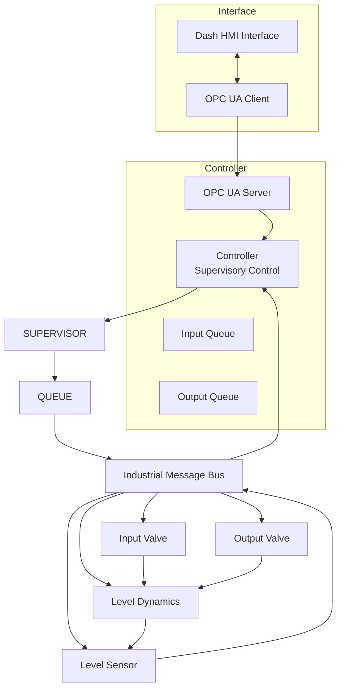
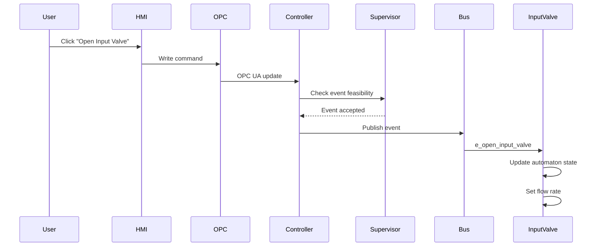
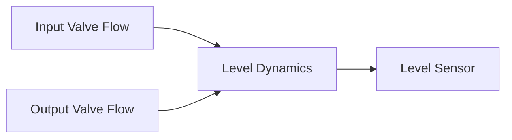
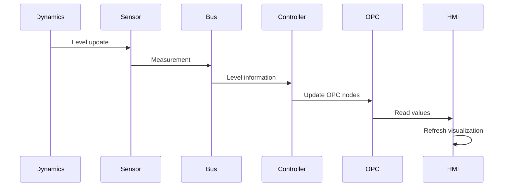
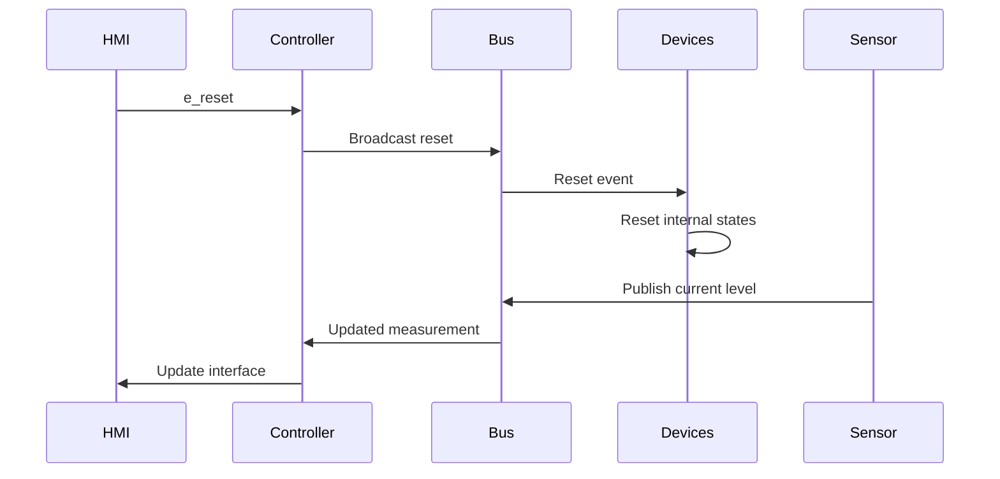

# AttackPlatform Architecture

## Overview

The AttackPlatform simulates an industrial control system (ICS) composed of:

- Human Machine Interface (HMI)
- OPC UA communication
- Supervisory Controller
- Discrete Event System (DES) automata
- Industrial communication bus
- Sensors and actuators
- Physical process dynamics

---

## System Architecture

---

## Command Flow

---

## Physical Process Flow

---

## Measurement Flow

---

## Reset Flow

